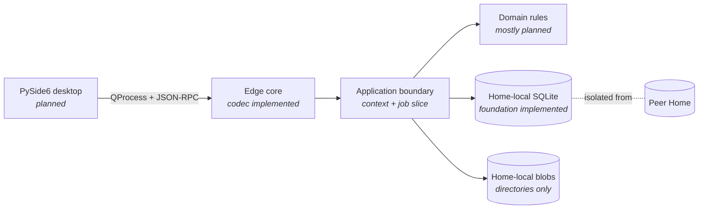

<p align="center">
  
</p>

<p align="center">
  
  
  
  
</p>

Smart Field Engineer is an offline-first desktop operations system for a trusted independent field engineer. It is designed to keep two business Homes isolated while managing jobs, evidence, serial identity, office records, scheduling holds, durable command receipts, backups, and legacy imports on one local Windows laptop.

> [!IMPORTANT]
> This repository is a pre-release implementation workbench, not an installable application. The storage and first command boundary are real; most product workflows and the desktop UI are not implemented yet.

## What exists today

- A reviewed 20-method JSON-RPC contract with 479 accepted and 503 rejected schema specimens.
- Real provisioning for two independent Homes, each with its own SQLite ledger and blob roots.
- Handle-owned writer exclusion, forward-only migrations, WAL/FULL/FK database configuration, and Home/store identity checks.
- Strict bounded JSON framing, selected-context authorization, and context generation invalidation.
- Atomic `job.create` facts, audit entries, durable receipts, idempotent replay, conflict detection, and bounded job pagination.
- Real foundation and command-boundary tests, plus preserved contract, provenance, decision, and legacy-import source material.

The next milestone is to harden the current execution boundary, then add the real process transport and integration-test driver. See the [implementation roadmap](../fullkit/docs/IMPLEMENTATION-ROADMAP.md) for the complete sequence and exit criteria.

## Architecture



Production is intentionally local and out-of-process: the desktop will own no writable SQL connection, and all ledger mutations will cross the same serialized command boundary.

## Start here

| If you want to… | Read… |
|---|---|
| Understand the workbench | [START-HERE.md](../START-HERE.md) |
| See current implementation status | [Implementation roadmap](../fullkit/docs/IMPLEMENTATION-ROADMAP.md) |
| Work on the code | [CONTRIBUTING.md](../CONTRIBUTING.md) |
| Review community expectations | [Code of conduct](../CODE_OF_CONDUCT.md) |
| Read the governing contract | [Contract entry point](../fullkit/contract/README.md) |
| Trace adopted decisions | [Authority register](../decisions/AUTHORITY.md) |
| Review foundation evidence | [Store foundation](../fullkit/docs/STORE-FOUNDATION.md) |
| Restore the toolchain | [Environment guide](../environment/README.md) |
| Report a vulnerability | [Security policy](../SECURITY.md) |
| Ask for help | [Support guide](../SUPPORT.md) |

## Development setup

The reproducible bootstrap currently supports Apple Silicon macOS and Windows x64. A reviewed Linux dependency lock does not yet exist.

```sh
python3 scripts/bootstrap.py --plan
python3 scripts/bootstrap.py
```

The bootstrap installs the pinned Python 3.13.15 runtime and project dependencies inside the checkout. It does not alter the system Python. See [Git mirroring and clean-clone setup](../GIT-MIRRORING.md) before running or publishing the project.

## Product boundary

Slice 1 is intentionally narrow: one trusted Windows owner, one laptop, two isolated Homes, local capture, and offline operation. It does not include cloud sync, telephony, OCR/ASR, connectors, payment automation, autonomous agents, or a plugin platform.

The effective contract is version 1.00.2. Windows locking, ACLs, encryption observation, offline rendering, clean installation, and power-loss behavior remain release qualification—not inferred capabilities.

## Repository status

This source is available for review and development, but the owner has not selected a project distribution license. Do not infer redistribution rights from dependency licenses or repository visibility. No stable release has been published.
